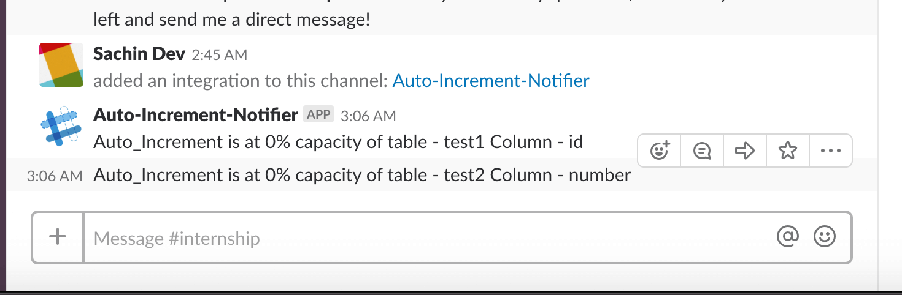

## MySQL Auto Increment Checker

The below script will Monitor the MySQL Database `postman` (change it to required Database) for tables which are about to run out of auto_increment ids and notify it in Slack.

## Prerequisites 

Below are the libraries used in the notebook.

```python
MySQLdb, requests
```


## How to run this project

1. Install the required Libraries.

```python
pip3 install MySQLdb
pip3 install requests
```

2. Change the url to [Slack Web Apps Url](api.slack.com/apps/). 

3. Change user credentials and Database name of MySQL Server.

4. Run the command:` jupyter notebook` and then select the file `MySQL Auto Increment Checker.ipynb` from the browser.


## Output



## Authors

1. [Sachin Dev S](https://github.com/heysachin)
